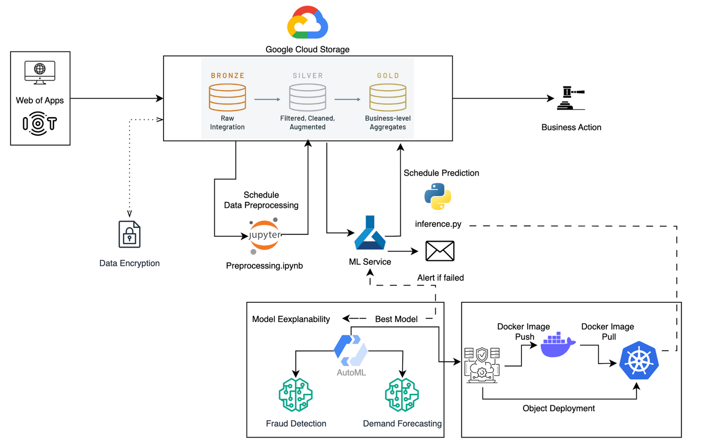

<h1>DataCo Smart Supply Chain Analysis</h1>

<h2>Executive Summary</h2>

This project focuses on leveraging the DataCo Smart Supply Chain dataset from Kaggle to build predictive models that serve critical business functions: forecasting monthly demand, detecting fraudulent orders, and clustering orders to identify common traits in fraud cases. Through sophisticated data analysis and machine learning techniques, this initiative aims to enhance operational efficiency, mitigate risks, and drive strategic decision-making in supply chain management.

Structured into two phases, this project begins with Phase 1, focusing on the development of predictive models to aid businesses in conducting demand forecasts and identifying fraud threats. Phase 2 involves the application of advanced methods such as MLflow and H2O to enhance model development, construct comprehensive data pipelines, and integrate techniques for model fairness and explainability. Additionally, we create a comprehensive architectural plan to package the models seamlessly from local environments to Google Cloud, ensuring smooth operations across devices.

<h2>Dataset Overview</h2>

The dataset comprises supply chain data from DataCo Global, including transaction records, customer data, product information, and logistics. Key features include order IDs, product categories, quantities ordered, customer locations, payment methods, and more. This rich dataset provides a comprehensive view of the company's operations, serving as a foundation for our predictive models.

Key Dataset Features:

<ul>
<li><b>Orders:</b> Contains over 180,000 unique order records, enabling detailed purchase pattern analysis and demand forecasting.</li>
<li><b>Unique Customers:</b> Features a diverse customer base with more than 30,000 unique profiles, ideal for customer segmentation and personalized strategy development.</li>
<li><b>Products:</b> Includes details on over 10,000 unique products, offering insights into inventory needs and product popularity.</li>
<li><b>Geographical Coverage:</b> The data spans multiple countries, allowing for global supply chain insights and regional analyses.</li>
<li><b>Fraud Indicators:</b> Contains markers for potential fraud, aiding in the creation of effective fraud detection models.</li>
<li><b>Rich Details:</b> Offers comprehensive information on customer demographics and order specifics such as shipping methods and payment channels.</li>
</ul>

<h2>Models</h2>
<h3>Phase 1:</h3>
<h3>1. Monthly Demand Prediction</h3>

This model aims to predict the monthly demand for products in the supply chain. By understanding demand patterns, the company can optimize inventory levels, reduce holding costs, and improve customer satisfaction.

<ul>
<li><b>Features Used:</b> Historical sales data, product categories, time-series features.</li>
<li><b>Algorithms Considered:</b> LSTM, Linear Regression, Gradient Boosting, Random Forest.</li></ul>

<h3>2. Fraud Order Detection Prediction</h3>

This model focuses on identifying potentially fraudulent transactions. Early detection of fraud can significantly reduce financial losses and protect the company's reputation.

<ul>
<li><b>Features Used:</b> Payment methods, order amounts, customer behavior patterns.</li>
<li><b>Algorithms Considered:</b> Logistic Regression, Random Forest, Gradient Boosting.</li></ul>

<h3>3. Fraud Order Traits Clustering</h3>

Beyond detection, understanding common traits among fraudulent orders can help in developing more effective prevention strategies. This model clusters fraudulent orders to uncover these traits. While fraudsters constantly evolve their strategies to bypass detection mechanisms, the model can adapt to new patterns by updating the model with new data.

<ul>
<li><b>Features Used:</b> Attributes of orders flagged as fraudulent.</li>
<li><b>Algorithms Considered:</b> K-Means, DBSCAN, Agglomerative Clustering.</li></ul>

<h3>Phase 2:</h3>
In this phase, our focus is primarily on refining demand forecast and fraud detection models through further analysis and approaches.
<h3>1. MLflow and H2O</h3>

This approach aims to improve the model development results in phase 1. Both use cases are conducted through H2O and MLflow techniques.

<ul>
<li>Commence the MLflow experiment, setting up and training models using H2O's AutoML functionality, limiting the models to 12 for manageability, and diligently logging configuration parameters and metrics.</li>
<li>Display variable importance, preserve the AutoML leaderboard, and conclude the MLflow experiment to finalize logging and tracking procedures.</li>
</ul>
<h3>2. Model Fairness and Explainability</h3>
<ul>
<li><b>FairML:</b> Utilize FairML to evaluate the models by quantifying the relative significance of the model’s variables.</li>
<li><b>LIME:</b> Use LIME to explain the model’s prediction for individual instances.</li></ul>

<h2>Methodology</h2>

In the handling of a substantial dataset exceeding 180,000 rows and 40 columns, comprehensive preprocessing was imperative in both the exploratory and model development phases to guarantee robust outputs. The exploratory data analysis (EDA) included pruning columns with unique values and restructuring datetime columns. This refined dataset was then saved as a CSV to facilitate subsequent modeling. The EDA examined numerical and categorical variables distinctly and included an OLS regression analysis detailing total profit per order, temporal order trends, and an assessment of fraudulent transactions, thus laying the groundwork for subsequent predictive modeling.

<h3>Phase 1:</h3>

In phase 1, we developed three types of models to provide comprehensive analysis on supply chain dataset.

In Demand Prediction, models aggregated sales, shipping durations, and product prices to forecast monthly orders. Data preprocessing preceded feature selection via Random Forest. Subsequent tuning involved Long Short-Term Memory (LSTM) networks, Random Forest, Gradient Boosting, and Logistic Regression models, leveraging Mean Absolute Error (MAE) and Mean Squared Error (MSE) metrics to refine predictive accuracy.

For Fraud Detection, the dataset underwent preprocessing, including feature engineering and label encoding, followed by oversampling to correct data imbalances. Recursive Feature Elimination (RFE) was utilized for feature selection. The tuning of the model involved ensemble methods, employing a voting classifier that integrated Logistic Regression, Random Forest, and Support Vector Machine (SVM), alongside boosting algorithms such as XGBoost and LightGBM, which enhanced the accuracy of fraud identification.

In Fraud Order Clustering, preprocessing including filtering and standardization was performed prior to selecting the optimal cluster count via inertia calculation. The KMeans algorithm clustered the data, and cluster centroids were inversely transformed for feature visualization. DBSCAN was also employed to derive six distinct clusters and detect dataset noise, thereby strengthening the fraud detection process.

<h3>Phase 2:</h3>

In phase 2, our objective was to enhance the models and structure a comprehensive architecture map.

To advance the models, we address missing values and streamline our dataset by dropping unnecessary columns. Following this, we aggregate the data based on categories such as "Type" and "Customer City" to facilitate further analysis. In this step, we also noticed the potential data leakage issue and dropped some columns to avoid this problem. Next, we retrieve the initial 2000 rows of data to conduct our subsequent analysis. Then, we initialize the H2O machine learning platform and import our dataset, converting the dataframe into an H2O Frame for compatibility.

Subsequently, we begin the MLflow experiment, setting up and training models using H2O's AutoML functionality. To ensure manageability, we restrict the number of models generated to 12. Throughout this process, we meticulously log configuration parameters and metrics, which encompass the number of models, RMSE, and R^2 for demand forecast, as well as F1 score and precision score for fraud detection. Following model training, we display the variable importance and preserve the AutoML leaderboard for reference. Finally, we conclude the MLflow experiment, thereby finalizing the logging and tracking procedures.

<h2>Architecture</h2>

<h2>Results and Discussion</h2>

In Demand Prediction, Gradient Boosting emerged as the superior model among four candidates, achieving a mean squared error of 9.05, indicating its effectiveness in forecasting product demand across various categories and regions, thereby facilitating inventory management. For Fraud Detection, the LightGBM model stood out with an F1 score of 0.72 and precision of 0.65, outperforming other models. Notable features for detecting fraud included the type of transaction, late delivery risk, shipping mode, and order month. This detection is crucial in mitigating financial losses and refining demand prediction models. Collectively, these models provide a multifaceted approach to improving operational efficiency, securing revenue, and ensuring sustainable business growth through data-driven decision-making.

Further refining the models, we focused on Demand Prediction and Fraud Detection models. For Demand Prediction, after experimenting with H2O, the final model is a deep learning model. This model exhibited improved performance with an R^2 of 0.97, compared to the previous model's R^2 of 0.95. In terms of Fraud Detectionm, gradient boosting was selected as the final model, achieving an F1 score of 0.86. The performance of this model demonstrated a superior F1 score compared to the model in phase 1.

<h2>Team Members</h2>

<h3>Phase 1</h3>
<ul>
<li><b>Ge Gao</b> - Data Scientist</li>
<li><b>Hongyi Zhan</b> - Data Scientist</li>
<li><b>Kelly Kao</b> - Data Scientist</li>
<li><b>Ko-Jen Wang</b> - Business Analyst</li>
<li><b>Rebecca Zhang</b> - Product Manager</li>
<li><b>Yanhuan Huang</b> - Data Analyst</li>

</ul>

<h3>Phase 2</h3>
<ul>
<li><b>Ge Gao</b> - Data Scientist</li>
<li><b>Hongyi Zhan</b> - Data Scientist</li>
<li><b>Kelly Kao</b> - Data Analyst</li>
<li><b>Ko-Jen Wang</b> - Project Manager</li>
<li><b>Yanhuan Huang</b> - Data Analyst / Data Engineer</li>
<li><b>Yusen Tang</b> - Data Engineer</li>

</ul>

